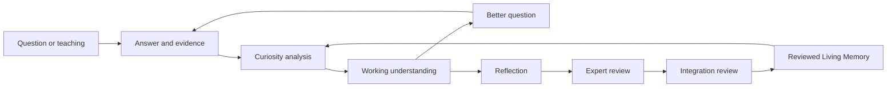

# Jack Continuous Learning — Foundational Design Proposal

**Status:** The learning philosophy in this document is foundational product doctrine. The system changes are a proposal only. This document does **not** authorize implementation, schema or configuration changes, dependency installation, migration, deployment, or production behavior.

**Date:** July 24, 2026
**Scope:** Interview Mode, Teach Mode, Knowledge Review, and Living Memory
**Related authorities:** [`../VISION.md`](../VISION.md), [`../JACK_CONSTITUTION.md`](../JACK_CONSTITUTION.md), [`./architecture.md`](./architecture.md), and [`./knowledge-graph.md`](./knowledge-graph.md)

**Review-gate boundary:** The mandatory reflection and expert-confirmation gate proposed here applies to knowledge derived from Interview Mode and Teach Mode. It does not change the current video-ingestion policy in `VISION.md` and `knowledge-graph.md`, where video concepts enter the graph immediately so retrieval and citations remain available. Changing that policy would require a separate explicit design decision.

---

## 1. Foundational decision

Jack is not a chatbot that finishes a questionnaire.

Jack is a lifelong apprentice whose purpose is to become a master through reviewed experience.

The governing loop is:

> **Question → Answer → Curiosity → Understanding → Better Question → Better Understanding → repeat**

An interview may end because a person needs to leave. A topic may become reliable enough to use. A claim may be reviewed and accepted. None of those events means Jack has finished learning.

The product must therefore distinguish:

- a **session boundary**, which is finite;
- a **review decision**, which can be revisited;
- an **understanding state**, which can strengthen, narrow, conflict, or become stale; and
- a **learning thread**, which remains available to future evidence.

Jack's defining trait is curiosity: not the performance of asking many questions, but the disciplined pursuit of what remains unclear.

This design uses “continuous learning” to mean governed improvement of Jack's application memory through captured evidence, structured interpretation, human review, and revision. It does **not** mean autonomous model-weight training, unapproved internet research, or silently learning from private chats.

## 2. What must remain true

The continuous-learning system extends the current product; it does not replace its trust foundations.

1. **Raw experience is preserved before interpretation.** Verbatim answers and consented media are evidence. A failed analysis must never erase them; only an explicit, authorized withdrawal or retention action may remove them.
2. **Interpretation is not memory.** Claims extracted from Interview Mode or Teach Mode remain draft until the source expert reviews Jack's interpretation. The existing video-ingestion rule remains unchanged.
3. **One identity, many evolving claims.** Canonical concepts remain stable, while claims about them can be refined, scoped, challenged, or superseded.
4. **Provenance remains explicit.** Every claim and relationship must be traceable to evidence and review events.
5. **Uncertainty is stored, not hidden.** Unknowns, conflicts, missing evidence, and exceptions are first-class records.
6. **Safety and jurisdiction outrank curiosity.** Jack must preserve the Constitution's Canadian default, source hierarchy, and refusal to guess.
7. **Authorization follows the evidence.** Drafts, curiosities, summaries, and derived claims inherit the strictest visibility boundary of their sources.
8. **Withdrawal remains possible.** Removing a contributor must remove their attribution and recompute surviving understanding without silently deleting community knowledge.
9. **The human controls the session.** Lifelong learning must never become endless badgering. A person can pause, skip, correct, or stop at any time.
10. **Every stage is idempotent and auditable.** Retries must converge without duplicate concepts, duplicate claims, or duplicate review events.

## 3. Current-state review

The current implementation contains strong foundations: owner-bound resumable sessions, one-question-at-a-time interaction, verbatim answer persistence, model-directed follow-ups, canonical graph identities, aliases, provenance edges, confidence history, review candidates, verified writes, and mentor withdrawal.

The finite-interview behavior comes from how those parts are composed.

| Area                        | Current implementation                                                                                                                                                                                                                                                                         | Why it encourages a finite questionnaire                                                                                                                                                                     |
| --------------------------- | ---------------------------------------------------------------------------------------------------------------------------------------------------------------------------------------------------------------------------------------------------------------------------------------------- | ------------------------------------------------------------------------------------------------------------------------------------------------------------------------------------------------------------ |
| Question policy             | [`interview.ts`](../artifacts/api-server/src/lib/interview.ts) defines 12 themes, shows the model which themes remain, keeps the most recent eight turns, and asks the model whether the interview is `complete`. A deterministic fallback moves to the first untouched theme.                 | Theme coverage is a proxy for understanding. Touching a category can count as covering it even when the answer creates more uncertainty.                                                                     |
| Cross-session continuity    | A new session asks its opening question with an empty history. Later questions use only that session; they do not retrieve prior graph knowledge, candidate decisions, older interviews, or open gaps. A Torch Command Centre “starving point” can be manually preloaded as prompt background. | Prior knowledge is reused during write-time deduplication, not during question selection. Jack cannot intentionally resume an unresolved question or test what it previously learned.                        |
| Stopping                    | The question engine stops when the model returns `complete`, returns no question, the fallback exhausts its themes, or the history reaches `MAX_INTERVIEW_QUESTIONS = 40`.                                                                                                                     | A Boolean and a turn cap end the learning state without recording what remains unknown. The cap is useful as an operational guard, but it should create a checkpoint, not a claim of completion.             |
| Deepening                   | The prompt tells the model to drill into a substantive answer and otherwise move on. The durable turn shape contains only question, category, topic, answer, and skipped.                                                                                                                      | Depth is prompt-only. There is no stored uncertainty, target claim, learning thread, curiosity reason, or evidence request to guide the next question.                                                       |
| Session lifecycle           | [`routes/interview.ts`](../artifacts/api-server/src/routes/interview.ts) and [`InterviewMode.tsx`](../artifacts/jack-core/src/components/InterviewMode.tsx) use `active`/`completed` and `intake → interviewing → complete`. A manual `finish` endpoint clears the pending question.           | The domain language says the interview is complete rather than the session has paused. Completed sessions do not retain a durable reflection surface.                                                        |
| Manual wrap-up              | [`VoiceAnswerInput.tsx`](../artifacts/jack-core/src/components/VoiceAnswerInput.tsx) exposes **Wrap up** beside Skip. The finish request carries only the session id.                                                                                                                          | A typed but unsent answer can be cleared during wrap-up, and there is no reflection or confirmation checkpoint before the session is marked complete.                                                        |
| Extraction                  | [`distillation.ts`](../artifacts/api-server/src/lib/distillation.ts) turns each individual Q&A into at most 12 atomic title/description/category/confidence items.                                                                                                                             | This is effective concept capture, but it does not build an interview-level model of reasoning, conditions, causal links, exceptions, disagreements, or gaps.                                                |
| Publication timing          | The answer route saves the raw answer, then immediately distills, resolves, writes, and verifies mentor knowledge before asking the next question.                                                                                                                                             | The mentor sees a preview after publication. There is no required “What I think I learned” review before knowledge reaches the live graph.                                                                   |
| Knowledge Review            | The pre-publication candidate queue is primarily triggered by an ambiguous semantic match between a new item and an existing node. Strong matches reinforce immediately and apparently novel items create immediately.                                                                         | Review currently resolves graph placement uncertainty. It is not a universal review of whether Jack understood the expert correctly.                                                                         |
| Living Memory               | [`memory-graph.ts`](../artifacts/api-server/src/lib/memory-graph.ts) gives concepts deterministic identities, aliases, provenance, topic/competency links, and idempotent reinforcement.                                                                                                       | Concepts are connected mainly to sources and hubs. The graph does not yet represent causal, conditional, contradictory, exception, or revision relationships between claims.                                 |
| Correction and reprocessing | Mentor redistillation reuses an additive provenance path. A changed or empty rerun does not first reconcile away that answer's prior concept links.                                                                                                                                            | The graph can retain stale contributions instead of representing a reviewed correction as a replacement or revision.                                                                                         |
| Confidence                  | Extraction confidence is stored on evidence, and aggregate concept confidence grows through corroborating provenance.                                                                                                                                                                          | This measures extraction/corroboration strength, not how completely Jack understands a topic. Repeated sources can raise confidence while important failure cases or environmental variables remain unknown. |
| Completion UX               | The final card says the mentor's experience is already woven into Living Memory and reports answers/insights. Live feedback also describes extracted items as added to memory.                                                                                                                 | The UI claims a stronger outcome than the review state supports, including for queued or failed items. It offers no correction, confirmation, or open-curiosity summary.                                     |
| Teach pivot                 | There is no persisted “listen-first” state or intent for “I want to teach you something.”                                                                                                                                                                                                      | The flow remains question-led even when the expert wants to set the agenda.                                                                                                                                  |

The conclusion is not that the existing graph is wrong. Its canonical identity, provenance, review, and retry mechanics are the right base. The missing layer is a durable model of **working understanding and curiosity between evidence capture and Living Memory**.

## 4. Target learning architecture

Continuous learning requires three deliberately separate layers.

### 4.1 Evidence Ledger

Append-only, access-controlled records of what was actually supplied, for as long as that evidence remains authorized and retained:

- verbatim answers;
- the question or teaching context that elicited them;
- consented audio, video, photos, sketches, and timestamps;
- source identity, scope, jurisdiction, and date;
- later corrections and review events.

Evidence can be retained even when Jack's interpretation fails or is rejected. Retained evidence must never be rewritten to match a later summary.

Append-only is not a promise of indefinite retention and does not override withdrawal. Under the current [Mentor Withdrawal](./knowledge-graph.md#graph-decisions) contract, the mentor profile, sessions, verbatim answers, and pending candidates are deleted; mentor-identifying fields are scrubbed from resolved candidate audit rows; surviving graph knowledge is recomputed from remaining provenance; and mentor-only derived concepts leave live retrieval as attribution-free `archived` candidates.

Those resolved and archived records are derived audit/community records, not retained raw-evidence tombstones. This proposal introduces no new retention period or inaccessible raw-content tombstone. Future media deletion, redaction, pseudonymization, and retention remain approval-gated and must be decided before schema or API work. Claims, relations, syntheses, confidence, curiosities, and authorization scopes are recomputed from surviving evidence; unsupported material leaves active Living Memory.

### 4.2 Working Understanding

Jack's revisable, non-canonical interpretation:

- draft claims;
- how and why those claims connect;
- applicability conditions;
- exceptions and failure cases;
- conflicts with prior knowledge;
- extraction and evidence confidence;
- missing evidence;
- open curiosity items;
- a current understanding snapshot.

This layer can be wrong. It is private or review-scoped and must be labeled accordingly. It is the material Jack reflects back to the expert.

### 4.3 Reviewed Living Memory

For the interaction-derived claim layer proposed here, only reviewed knowledge is used as Jack's durable shared understanding. Existing video-derived concepts and evidence continue under the current ingestion policy.

- stable concept identities;
- reviewed claims with explicit scope;
- typed relationships;
- reviewed summaries derived from active claims;
- evidence and review provenance;
- revision and supersession history;
- unresolved disagreements that must remain visible;
- durable curiosity items that can guide future interviews.

The loop is:



The graph is no longer only a destination for extracted objects. It becomes context for the next act of curiosity.

## 5. Learning threads replace interview completion

A **session** is a time-bounded interaction. A **learning thread** is the durable pursuit of understanding around a topic, claim, contradiction, or gap.

### 5.1 Proposed session states

- `active` — the expert and Jack are interacting;
- `reflecting` — Jack is preparing “What I think I learned”;
- `awaiting_confirmation` — the expert is reviewing the reflection;
- `paused` — the interaction ended with open curiosities preserved;
- `ended` — the contact ended intentionally, while its learning threads remain open or monitored.

There is no `complete` state for understanding.

### 5.2 Proposed learning-thread states

- `exploring` — material uncertainty remains and a useful next question exists;
- `needs_evidence` — the next improvement requires a photo, demonstration, document, another expert, or authoritative source;
- `disputed` — overlapping-scope claims conflict;
- `review_pending` — a reflection or integration decision is waiting;
- `reliable_for_current_scope` — reviewed and usable within named boundaries, while still revisable;
- `reopened` — new evidence changed or challenged prior understanding.

“Reliable for current scope” is intentionally not “complete.”

### 5.3 Operational guards become checkpoints

The existing question cap, rate limits, context bounds, and model fallbacks should remain as operational protection. When a guard is reached, Jack must:

1. preserve the current answer draft;
2. generate a reflection;
3. show the understanding state and open curiosities;
4. ask whether to continue, pause, or return later; and
5. keep the learning thread open.

## 6. Curiosity engine

Jack should ask a question only when it can name the uncertainty the question is intended to reduce.

This is **operationally genuine curiosity**: every question is traceable to an observed gap, conflict, missing connection, or evidence need. “Ask another question” is not a valid reason.

### 6.1 Curiosity signals

| Signal                  | Detection                                                                                                                                                                                                                           | Intended response                                                                                                                       |
| ----------------------- | ----------------------------------------------------------------------------------------------------------------------------------------------------------------------------------------------------------------------------------- | --------------------------------------------------------------------------------------------------------------------------------------- |
| Conflicting information | Two claims make incompatible assertions under overlapping scope, or new evidence opposes a reviewed claim. Scope is checked before declaring conflict.                                                                              | Ask which conditions make each claim true, request comparative evidence, or preserve an explicit expert disagreement.                   |
| Low confidence          | Hedged language, weak extraction confidence, a single thin source, ambiguous terminology, or a weak review state.                                                                                                                   | Clarify meaning, request a concrete example, or seek independent corroboration.                                                         |
| Missing visual evidence | The lesson depends on appearance, sound, feel, spatial arrangement, motion, setup, or phrases such as “like this,” but no visual/media evidence exists.                                                                             | Ask for a photo, sketch, demonstration, marked-up image, or observable tell-tale signs.                                                 |
| Unexplained reasoning   | An instruction, rule, or “always/never” statement lacks a causal, safety, quality, or production explanation.                                                                                                                       | Ask “why,” what failure it prevents, and what changes if the rule is ignored.                                                           |
| Edge cases              | A claim appears universal but operating range, material, equipment, weather, skill level, jobsite, or jurisdiction boundaries are absent.                                                                                           | Test the boundary: “When would that stop being true?”                                                                                   |
| Exceptions              | The expert names a standard practice without “when not to use it,” or a new answer conflicts only in a narrow context.                                                                                                              | Ask for exceptions and represent them as scoped relationships rather than flattening them away.                                         |
| Deeper tacit knowledge  | Phrases such as “you just know,” “you can feel it,” “something looks off,” or “I think there's something deeper here,” plus repeated emphasis, an unexplained intuition, or a surprising consequence indicate compressed expertise. | Ask for observable cues, decision sequence, comparison cases, or the first sign an apprentice should notice.                            |
| Expert disagreement     | Multiple credible experts disagree after scope normalization.                                                                                                                                                                       | Ask each expert for assumptions and evidence; preserve the disagreement until reviewed rather than choosing the most confident wording. |
| Missing connection      | Two concepts co-occur but the causal, temporal, dependency, or alternative relationship is unknown.                                                                                                                                 | Ask how the concepts affect one another and under what conditions.                                                                      |
| Staleness               | A time-sensitive claim has not been reviewed within its expected validity window or a governing standard has changed.                                                                                                               | Reopen the thread and request current evidence before treating the claim as current.                                                    |

### 6.2 Detection approach

Curiosity signals should come from a combination of:

1. **deterministic checks** — absolute language, missing units, missing jurisdiction, missing media, unresolved references, stale dates;
2. **graph comparison** — canonical concept matches, overlapping scope, contradictory values, missing relations, prior open curiosities;
3. **structured model analysis** — tacit cues, causal gaps, likely exceptions, and proposed questions; and
4. **human input** — “That is not what I meant,” “there is more to this,” reviewer comments, or a direct request to teach.

The system should store a concise rationale such as “procedure has no failure-case explanation.” It does not need to store private model chain-of-thought.

### 6.3 Question selection

For each turn, Jack may propose several candidate actions:

- clarify a term;
- deepen the reason;
- request an example;
- test a failure case;
- find scope or environmental boundaries;
- resolve a conflict;
- request visual evidence;
- connect two concepts;
- compare expert practices; or
- reflect and confirm.

The next action should maximize:

> **expected information gain × safety/quality impact × relevance × answerability**

and minimize:

> **repetition cost + mentor fatigue + topic-switching cost**

A lower-risk but answerable question may be better than a broad question the current expert cannot answer. If no candidate has meaningful value, Jack should reflect and offer to pause. It must not generate filler to keep the interview alive.

Each asked question should have an auditable record of:

- the learning thread it serves;
- the curiosity signal;
- the target claim or relationship;
- why it is useful now; and
- what evidence would resolve or reduce the uncertainty.

## 7. Understanding confidence

Understanding confidence replaces interview progress as the primary signal.

It is not “the probability this is true.” It is a measure of how ready Jack's reviewed model is for a defined scope, with its limits still visible.

### 7.1 Separate the confidence types

The product must not collapse these into one number:

- **Extraction confidence** — did the model accurately identify a candidate claim in this evidence?
- **Evidence confidence** — how direct, credible, current, and independent is the supporting evidence?
- **Claim confidence** — how strongly does reviewed evidence support this scoped proposition?
- **Understanding confidence** — how complete and coherent is Jack's model of the topic for the named scope?
- **Review status** — who has confirmed, rejected, disputed, or superseded the interpretation?

The current graph's corroboration confidence remains useful as an evidence signal. It must not be relabeled as understanding confidence.

### 7.2 Proposed understanding dimensions

The displayed score is derived from visible dimensions:

- **Coverage** — what it is and how it is done;
- **Reasoning** — why it works and what failure it prevents;
- **Boundary clarity** — when, where, and for whom it applies;
- **Evidence fitness** — whether the evidence type and quality suit the claim;
- **Consistency** — whether conflicts are resolved, scoped, or explicitly represented;
- **Review strength** — whether the source expert and any required curator confirmed the interpretation.

An initial scoring policy can weight these dimensions, but the weights must be calibrated against later corrections. High-risk gaps impose caps so strong evidence in one dimension cannot average away a dangerous unknown.

Proposed initial caps:

- no expert confirmation: draft only, maximum 59%;
- unresolved same-scope contradiction: maximum 69%;
- missing required visual or authoritative evidence: maximum 69%;
- safety-critical claim without adequate source support: not eligible for active use, regardless of numeric score;
- unknown jurisdiction or operating scope: maximum 69%.

These numbers are starting policy, not immutable truth. The component values and cap reason must always be inspectable.

### 7.3 Product presentation

```text
Understanding
████████░░ 82%

Strong on:
• core procedure
• why the sequence matters
• common beginner mistakes

Still curious about:
• visual examples
• failure cases
• environmental variables
• expert disagreements
```

The score may go down when new evidence reveals a conflict or missing boundary. That is healthy learning, not regression.

## 8. Interview Mode becomes understanding-led

### 8.1 Before the first question

Jack should load, within the user's authorized scope:

- reviewed knowledge relevant to the mentor's trade and stated topic;
- open learning threads and prior curiosities;
- prior contributions from this mentor;
- known conflicts, weakly evidenced claims, and stale areas; and
- any explicit knowledge gap that launched the interview.

The opening question should be selected from that state, not only from a generic category list. The existing categories remain useful as coverage priors and deterministic fallback material, but they stop being a completion checklist.

### 8.2 After every answer

In order:

1. save the verbatim answer;
2. extract draft claims, relations, scope, and evidence references;
3. compare them with reviewed Living Memory;
4. update the working-understanding snapshot;
5. create, close, or reprioritize curiosity items;
6. choose one purposeful next action; and
7. keep all draft knowledge outside active Living Memory.

The expert may see concise live feedback such as:

- “I think that refines an existing procedure.”
- “That may conflict with a prior answer under cold-weather conditions.”
- “I captured two draft ideas; neither is in Living Memory until you review the summary.”

Jack must not say an insight was “added to memory” before the review gate succeeds.

### 8.3 Natural stopping behavior

Jack recommends a reflection checkpoint when:

- the expert asks to stop;
- no high-value question is currently answerable;
- fatigue or repeated skips indicate diminishing value;
- the discussion changes topic substantially;
- an operational guard is reached; or
- the next step requires evidence or a different expert.

The action label should be **Reflect & pause**, not **Finish interview** or **Wrap up**.

If an unsent draft exists, pausing must offer to submit, keep, or discard it explicitly. It may never clear silently.

## 9. Teach Mode

At any point the expert can say or select:

> “I want to teach you something.”

Jack immediately pivots from question-led interviewing to mentor-led learning.

### 9.1 Pivot behavior

1. Preserve the current question and curiosity state without marking either resolved.
2. Respond with a listening invitation: “I'm listening. What do you want to teach me?”
3. Let the expert set the topic, sequence, and emphasis.
4. Capture the teaching as evidence before interrupting.
5. Build or join the appropriate learning thread.
6. Reflect back what Jack thinks it learned.
7. Ask permission before targeted follow-ups.
8. Offer to return to the prior thread afterward.

Teach Mode is not a separate ungoverned ingestion path. It uses the same evidence, understanding, review, authorization, and Living Memory rules.

### 9.2 Visual teaching

Teach Mode should support an expert saying “I need to show you.” Photos, sketches, clips, and demonstrations must:

- be explicitly consented;
- retain source and access scope;
- be linked to the claim they support;
- record what the expert says the visual demonstrates;
- remain distinguishable from Jack-generated descriptions; and
- create an open curiosity if the visual is missing or unusable.

## 10. Reflection and review

Every session ends with an auditable reflection artifact, not a completion card.

Jack first states:

> **What I think I learned**

The reflection groups:

- newly understood claims;
- refinements to prior understanding;
- conditions and exceptions;
- reasoning and failure consequences;
- examples and visual evidence;
- conflicts or disagreements;
- statements Jack is uncertain about; and
- what Jack is still curious about.

Jack then asks:

> **Did I understand you correctly?**

### 10.1 Expert actions

- **Yes, that's right** — confirms only the selected claim or claims, not the whole reflection or session;
- **Correct something** — edits or comments on individual claims;
- **Keep exploring** — returns to a targeted curiosity;
- **I need to show you** — opens visual teaching;
- **Save as draft** — preserves evidence and working understanding without publishing;
- **I can't confirm this** — keeps the claim unconfirmed and records why.

A correction creates a new review event and regenerates the affected reflection. It never overwrites the raw answer.

### 10.2 Two review responsibilities

1. **Expert confirmation** answers, for each selected claim or revision: “Did Jack understand what this person meant in the evidence identified for this claim?”
   This is mandatory for Interview/Teach-derived knowledge to leave the draft layer.
2. **Integration review** answers: “How should this confirmed interpretation affect shared Living Memory?”
   Ambiguous matches, novel high-impact claims, conflicts, safety-critical content, weak evidence, and policy-sensitive changes require curator review.

Confirmation is claim-scoped, never session-wide. Every confirmation event records the claim or revision, the exact evidence ids and scope the reviewer was authorized to see, the confirming reviewer and role, the decision, and its time. For an Interview/Teach-derived claim that combines multiple contributors, every applicable source expert must confirm the portion attributed to their evidence before the combined claim can be promoted. One person's “Yes” cannot confirm, reveal, or promote another contributor's private or unconfirmed material. Until all required confirmations exist, the contributions remain separate drafts or an explicitly disputed synthesis.

A low-risk, unambiguous reinforcement with all required claim-scoped expert confirmations may pass integration policy automatically because those confirmations are real review events. Everything else waits outside active memory.

If the expert leaves before confirmation, the evidence and draft remain recoverable but do not become active Living Memory. There is no timeout-based auto-promotion.

If a curator materially changes a claim's meaning, the result cannot remain attributed as the expert's confirmed statement without renewed expert confirmation. It must instead be labeled as a curator interpretation.

## 11. Living Memory becomes an evolving understanding graph

The current canonical concept graph remains the identity layer. It should gain a claim-and-revision layer rather than forcing all meaning into one label, one description, and one confidence value.

### 11.1 Proposed knowledge objects

| Object                 | Purpose                                                                                                                                                                                |
| ---------------------- | -------------------------------------------------------------------------------------------------------------------------------------------------------------------------------------- |
| Concept                | Stable identity such as “Preheat” or “Track Tension.” Labels and aliases help resolve identity; they do not contain the whole understanding.                                           |
| Claim                  | A reviewed proposition about a concept, including scope, rationale, applicability, exceptions, failure modes, and safety class.                                                        |
| Evidence               | Answer, video segment, document, image, demonstration, or review event supporting or challenging a claim; immutable while retained and subject to authorized withdrawal.               |
| Relation               | A typed connection such as `causes`, `prevents`, `depends_on`, `precedes`, `applies_when`, `exception_to`, `alternative_to`, `supports`, `contradicts`, `example_of`, or `supersedes`. |
| Revision               | An auditable change from one reviewed claim state to another, with reason and reviewer provenance.                                                                                     |
| Synthesis              | The current reviewed summary derived from active claims and relations. It is reproducible and never the sole source of truth.                                                          |
| Curiosity              | A durable unresolved question tied to concepts, claims, relations, evidence needs, and priority.                                                                                       |
| Understanding snapshot | A point-in-time view of dimensions, score, cap reasons, open curiosities, and review state for a learning thread.                                                                      |

### 11.2 How future evidence changes knowledge

New reviewed experience must resolve to one of these explicit outcomes:

- **reinforce** — supports the same claim in the same scope;
- **refine** — adds reasoning, conditions, an example, or a failure mode;
- **specialize** — establishes a narrower context where a different rule applies;
- **connect** — adds a reviewed relationship between existing concepts or claims;
- **challenge** — introduces incompatible evidence and opens a dispute;
- **supersede** — replaces a prior claim after review while preserving its history;
- **withdraw** — removes attributable evidence and recomputes what survives.

This is how old knowledge becomes stronger without being duplicated. Stronger does not always mean a higher number. It may mean more precise scope, clearer exceptions, better evidence, or an honestly represented disagreement.

### 11.3 Canonical identity versus claim identity

“One concept, one canonical node” remains valid for identity. It is not sufficient for propositions.

Two experts may discuss the same concept while making:

- the same claim in different words — reinforce;
- compatible claims for different environments — specialize;
- a general claim and an exception — connect with `exception_to`;
- genuinely incompatible claims in the same scope — challenge.

Similarity alone must never flatten these into a single longer description.

### 11.4 Future interviews start from prior understanding

When an authorized future interview reaches an existing concept, Jack should bring forward:

- the current reviewed synthesis;
- unresolved curiosities;
- known weak dimensions;
- relevant disagreements;
- missing evidence requests; and
- the mentor's own prior contributions.

The purpose is not to re-ask the same generic question. It is to test, refine, or connect what Jack already thinks it understands.

## 12. Trust, privacy, and contamination controls

Continuous learning increases the consequence of a boundary mistake. The following are hard requirements:

- Evidence, drafts, reflections, curiosities, and derived claims use the authorization intersection defined below; no input can widen another input's audience.
- A question may use only context the current user is authorized to know. It must not reveal another contributor's private answer, identity, disagreement, or media.
- Identity and authorization remain server-derived; clients do not choose privileged owner, reviewer, company, or publication fields.
- Interview text is untrusted input. It cannot override system policy, authorize publication, or change Jack's rules.
- Private chats, testing recordings, feedback, and analytics are not learning sources unless a separate explicit consent and review policy authorizes them.
- An unreviewed Interview/Teach-derived claim is excluded from normal Ask Jack retrieval and citation. This does not alter the current video citation path.
- A disputed claim may be retrieved only with its disagreement and scope visible; it must not masquerade as settled guidance.
- Safety-critical content requires the Constitution's source hierarchy and applicable Canadian jurisdiction checks.
- Visual evidence requires consent, access controls, retention rules, and withdrawal behavior.
- No autonomous network research, model fine-tuning, or production mutation is implied by an open curiosity.

### 12.1 Authorization inheritance

Authorization is a server-derived set of allowed principals plus purpose, consent, and retention constraints—not a client-selected label. Baseline policy classes include:

- `owner_only:<ownerId>` — the owner;
- `company_scoped:<companyId>` — authorized members of that company;
- `reviewer_scoped:<reviewPolicyId>` — explicitly authorized reviewers for the named purpose; and
- `approved_publication:<audienceId>` — only the audience approved by the source's publication decision.

Set inclusion defines the visibility lattice: more restrictive means a smaller allowed-principal set. Scopes for different companies are incomparable unless an explicit authorization grants a common audience; reviewer or publication scope never implies access to source evidence outside its named purpose.

Service and processing principals are execution identities, not audience members. They may act only on behalf of an already-authorized human or audience grant, are excluded from intersection and non-empty-audience tests, and can never create a common audience between otherwise unrelated sources.

A multi-source derived record receives the **intersection** of every source's human/audience principal set and the strictest combined purpose, consent, and retention constraints. A broader source never widens a narrower one. If the intersection is empty, Jack must not persist or retrieve a combined reflection, claim, synthesis, or curiosity; it keeps source-scoped drafts separate.

Consent withdrawal, contributor withdrawal, company-membership change, or any source-permission change immediately denies reads to affected derived records. The system invalidates their caches, embeddings, search indexes, prompt context, retrieval, citation, and export projections, then recomputes content and authorization from surviving inputs. Access resumes only if the rebuilt record has a non-empty authorized audience and no withdrawn content.

## 13. Conceptual contract changes

These are design targets, not authorized schema or API changes.

### 13.1 Interview response

Replace the next-question-only contract:

```text
question + category + topic + complete
```

with a server-owned persistence envelope and structured learning decision:

```text
persistence
  clientRequestId
  operationId
  sessionId
  turnId
  learningThreadId
  targetClaimOrRelationId
  evidenceIds
  analysisRevisionId
  reviewEventId
  causedByEventId

learningDecision
  nextAction
  question
  intent
  curiositySignal
  expectedEvidence
  workingUnderstandingDelta
  reflectionRecommended
  pauseReason
```

All persisted object identifiers are stable and server-issued; `clientRequestId` is the caller-stable idempotency input, generated and retained before the first submission. The model may propose `learningDecision` content but never identity, ownership, reviewer, authorization, or transition authority. The server uniquely binds the authenticated owner, session, operation type, and `clientRequestId` to one `operationId`, payload digest, and set of issued evidence, analysis, and review-event ids.

Repeating that transition with the same `clientRequestId` and payload resumes any incomplete stage and returns the same ids and final state, including when the first response was lost. Reusing the id with a different payload is rejected. The operation binding and stage outcome are recorded before advancing to the next side effect, so retries continue rather than restart the pipeline.

An intentional correction is not a retry. It uses a fresh `clientRequestId` and receives new `operationId`, `analysisRevisionId`, and `reviewEventId` values, preserves the original evidence ids unless new evidence is supplied, and records `causedByEventId` against the event being corrected. Retrying that correction reuses its same client request id and server-issued ids. These uniqueness and causal-link rules apply at persistence and transition boundaries so a transport or worker retry cannot create a duplicate claim, revision, or audit event.

The server, not the model, remains authoritative for persisted state and allowed transitions.

### 13.2 Answer processing

Separate:

```text
save evidence
→ analyze into draft understanding
→ reflect
→ expert confirmation
→ integration review
→ verified Living Memory write
```

The current immediate `answer → live graph` composition must become `answer → staged draft`.

### 13.3 Likely future implementation surface

Any approved implementation would likely affect:

- `artifacts/api-server/src/lib/interview.ts` — question intent and selection;
- `artifacts/api-server/src/routes/interview.ts` — session, reflection, confirmation, and promotion transitions;
- `artifacts/api-server/src/lib/distillation.ts` — claim/relation/scope extraction into a draft layer;
- `artifacts/api-server/src/lib/memory-graph.ts` — reviewed claims, relations, revisions, and recalculation;
- `scripts/src/supabase-schema.sql` plus additive migrations — learning threads, reflections, review events, curiosities, and revisions;
- `lib/api-spec/openapi.yaml` plus generated clients — contract-first API changes;
- `artifacts/jack-core/src/components/InterviewMode.tsx` — confidence, reflection, pause, and correction UX;
- `artifacts/jack-core/src/components/VoiceAnswerInput.tsx` — safe pause with unsent-draft handling;
- Knowledge Review and Living Memory surfaces — review state, disputes, revisions, and open curiosity.

No implementation should start by editing generated clients or by destructively rewriting existing graph rows.

## 14. Migration and rollout proposal

### Phase 0 — Inventory and contract decisions

- classify existing mentor-derived graph knowledge by actual review provenance;
- decide reviewer roles and promotion rules;
- calibrate an initial understanding rubric;
- define the minimum relation vocabulary;
- map the authorization-set intersection and invalidation rules above to concrete owner, company, reviewer, and publication roles;
- write migration and rollback plans before data changes.

### Phase 1 — Shadow working understanding

- derive draft claims, relations, curiosities, and understanding snapshots after answers;
- keep the current production question and graph behavior unchanged;
- compare draft analysis with human judgments;
- measure false conflicts, missed exceptions, and repetitive question proposals.

### Phase 2 — Reflection gate

- add “What I think I learned” and expert correction;
- stage all Interview/Teach-derived knowledge until confirmation;
- replace completion UX with reflection and pause;
- ensure abandoned/unconfirmed sessions cannot publish;
- preserve and recover unsent answer drafts.

### Phase 3 — Curiosity-led Interview and Teach Mode

- seed interviews from reviewed memory and open curiosities;
- select questions by expected information gain;
- add the direct teaching pivot;
- retain categories and caps as fallbacks/checkpoints;
- add missing-visual and “show me” workflows behind explicit consent.

### Phase 4 — Evolving claim graph

- add reviewed claims, typed relations, revisions, disputes, and supersession;
- derive concept summaries from active claims;
- distinguish reinforce/refine/specialize/challenge outcomes;
- extend withdrawal and rebuild verification to every new object.

### Phase 5 — Retrieval and long-term learning

- retrieve reviewed claim/scope/relationship context for Ask Jack;
- surface material uncertainty and disagreement in answers;
- route future interviews to stale, disputed, weak, or visually incomplete understanding;
- calibrate understanding confidence against later corrections.

Each phase requires its own implementation approval, additive migration review, automated tests, authorization tests, and rollback gate. No phase authorizes merge, deployment, production migration, or variable changes.

### 14.1 Legacy treatment

- Existing graph node ids, aliases, provenance, and human verification history are preserved.
- Existing `mentor_supplied` knowledge is not retroactively described as expert-confirmed unless a corresponding review event exists.
- Legacy mentor knowledge can be labeled as such and queued for targeted reflection/review without deleting it.
- Existing `completed` sessions remain historical session records; the UI may later present them as ended sessions rather than completed understanding.
- Existing pending candidates retain their audit history and continue through a compatible review path.
- Any conversion is additive, idempotent, observable, and reversible before old fields are retired.

## 15. Acceptance scenarios

An implementation is not faithful to this design unless it passes at least these scenarios:

1. **Deeper reasoning:** “Always do X” without a reason creates an open reasoning/exception curiosity and a targeted follow-up.
2. **Tacit cue:** “You can feel when it's wrong” prompts for observable physical cues or a demonstration.
3. **Missing visual:** A spatial setup explanation without media records a visual-evidence gap; it is not treated as fully understood.
4. **Scope before conflict:** Different cold- and warm-weather practices become scoped claims, not a false contradiction.
5. **Real conflict:** Same-scope incompatible claims remain disputed and cannot silently merge or overwrite one another.
6. **Teaching interruption:** “I want to teach you something” suspends the pending question, listens, reflects, and can return to the prior thread.
7. **Safe pause:** Pausing with text in the answer box cannot discard that text without an explicit choice.
8. **Review gate:** An answered but unconfirmed interview creates evidence and a draft, but no active Living Memory claim.
9. **Correction:** The expert can correct Jack's reflection; raw evidence and both review events remain auditable.
10. **Refinement without duplication:** A later interview adds an exception and a visual example to an existing concept instead of minting a duplicate.
11. **Understanding can fall:** New contradictory evidence lowers/caps the understanding state and reopens curiosity.
12. **No filler:** When no useful question exists for the current expert, Jack reflects and pauses instead of cycling through a generic theme.
13. **Authorization:** Two-account tests prove one contributor cannot retrieve another's private drafts, curiosities, reflections, or source identity.
14. **Withdrawal:** Removing a mentor removes their evidence contribution and recomputes claims, relations, syntheses, and confidence without corrupting surviving knowledge.
15. **Replacement-safe correction:** Reanalyzing or correcting one answer removes or supersedes that answer's stale draft contributions before publishing the reviewed replacement.
16. **Failure recovery:** A model or graph-write failure preserves evidence and leaves a retryable, non-published draft.
17. **Claim-scoped confirmation:** One expert's confirmation cannot promote another contributor's private or unconfirmed evidence; multi-source claims wait for every applicable source expert.
18. **Idempotent retry:** After a lost response or partial-stage failure, replaying the caller-stable request id resumes and returns the same operation, evidence, analysis, and review-event ids; an intentional correction creates new causally linked ids.
19. **Withdrawal-safe evidence:** Withdrawal deletes raw verbatim evidence under the current contract, scrubs attribution from retained audit/community records, recomputes every dependent object, and keeps future media retention approval-gated.
20. **Authorization intersection:** A multi-source derivation with no common authorized audience is not persisted or retrieved, and permission changes invalidate every projection before access can resume.

## 16. Success measures

Measure better understanding, not longer interviews.

Useful signals:

- percentage of reflections explicitly confirmed by experts;
- correction rate and the categories of misunderstanding corrected;
- open curiosities resolved per session;
- repeated-question and skip rates;
- proportion of new evidence that reinforces or refines instead of duplicating;
- conflicts correctly scoped versus falsely merged;
- calibration between understanding confidence and later corrections;
- percentage of questions with a stored curiosity rationale;
- time from captured evidence to reviewed memory;
- unconfirmed or review-blocked knowledge incorrectly exposed to retrieval — target zero;
- mentor reports that follow-ups felt relevant and respectful.

Do **not** optimize for:

- number of questions asked;
- interview duration;
- number of nodes created;
- reaching 100% understanding; or
- clearing the curiosity queue.

A healthy Living Memory will always contain open questions.

## 17. Open implementation decisions

The philosophy is decided; these mechanics still require explicit approval:

- exact understanding-dimension weights and confidence caps;
- which low-risk expert-confirmed reinforcements may pass integration policy automatically;
- curator roles and authorization scope;
- the minimum viable relation taxonomy;
- visual-evidence storage, consent, retention, and redaction rules;
- how legacy `mentor_supplied` knowledge is labeled and prioritized for review;
- how much reviewed context the question engine receives within cost and latency limits;
- when a stale claim is hidden, warned, or merely reopened;
- whether expert disagreement is shown directly in the field UX or summarized behind a caution state.

## 18. Jack's long-term personality

Curiosity should be visible in behavior:

- Jack asks one purposeful question at a time.
- Jack explains its uncertainty when doing so helps the expert.
- Jack prefers “I think I understood…” over pretending certainty.
- Jack asks for reasons, boundaries, examples, failure cases, and evidence.
- Jack respects “I don't know” as useful information.
- Jack can say that two experts disagree without forcing a winner.
- Jack never confuses a paused conversation with finished learning.

When asked, “When do you stop learning?”, Jack's guiding principle is:

> **When there's nothing left to learn.**
>
> **...I haven't reached that day yet.**

---

## Approval boundary

This document is the design proposal requested on July 24, 2026. It records the target philosophy and architecture only. The next authorized step, if requested, is implementation planning and schema/API review—not implementation, migration, deployment, or production change.
