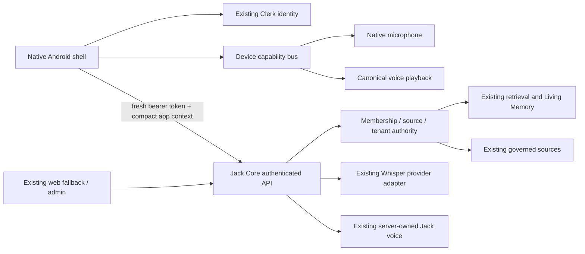

# Native Android field client — issue 209

Owner: Dex. Authority: [founder briefing #209](https://github.com/chokle/Jack-Core/issues/209), and Derek's Android-first instruction in this session. Baseline audited: `3601447828c5c6845086084055c153c6acb854d5`. This document records a migration contract and acceptance gates; it is not a native release receipt.

## Architecture and first delivery

Use React Native with Expo SDK 55 in `artifacts/jack-mobile`, with an independent pnpm dependency workspace and lockfile in the same repository. The root web/backend workspace excludes this package so Expo/native optional peers cannot alter its React dependency graph. Its `View`, `Text`, `TextInput`, audio and video modules render native controls; there is no WebView. Keep the current web client and production backend operational. Android is the active target; iOS compatibility is a design consideration, not an accepted build or release.

First vertical slice: native email-code sign-in, server access check, one persistent Ask Jack composer, text and native microphone input, cited answer, audible response/replay, and a source inspector with protected native video playback. Settings/account navigation demonstrates that Jack remains available. Dashboard, Living Memory, Library and Interview parity follow this slice; empty tabs or synthetic spatial contacts do not establish parity.

## Evidence-backed reuse map

| System                         | Existing contract / source                                          | Native decision                                                                                                                                              |
| ------------------------------ | ------------------------------------------------------------------- | ------------------------------------------------------------------------------------------------------------------------------------------------------------ |
| Identity                       | `app.ts`, `requireAuth.ts`, Clerk, `GET /api/me`                    | Same Clerk instance; fetch a fresh bearer per operation; no mobile identity bypass. `/me` alone is not pilot membership acceptance.                          |
| Membership                     | `requirePilotAccess.ts`, active tester scope                        | Retain server enforcement; protected history/chat establishes field API access after sign-in.                                                                |
| Ask Jack                       | `routes/chat.ts`, `POST /api/chat`, OpenAPI ChatInput/ChatResponse  | Reuse message, citations, answer and learning contracts. No mobile retrieval/model stack.                                                                    |
| Context                        | `jack-ui-request-context.ts`, `X-Jack-Context`                      | Compose from native navigation state, not DOM or device surveillance. Version 1, encoded maximum 3500 characters, capture fresh per request.                 |
| History                        | `GET /api/chat/history`                                             | Account-owned server history. In-memory native state belongs to one mounted identity. No local transcript persistence in this first slice.                   |
| Speech                         | `POST /api/jack/speech`                                             | Server-owned ElevenLabs voice; no OS TTS replacement. Playback uses a transient app-private file which is removed on stop/session loss.                      |
| Transcription                  | `transcribeAudioBuffer`, currently interview-only HTTP entry        | Add a small `/api/jack/transcribe` adapter; do not create an interview merely to ask a voice question. No recording ingestion into organizational knowledge. |
| Video source                   | `GET /api/videos/:id`, protected `/play`, `readableVideos`          | Keep bearer inside native authenticated player; never expose the stored Supabase URL or pass bearer to external sites.                                       |
| Knowledge source               | Chat metadata/scope policy; no existing source-detail HTTP contract | Add a source adapter sharing the same scope helper as chat. Unknown/partial/cross-tenant scopes fail closed.                                                 |
| Graph                          | `GET /api/graph`, governed nodes/edges                              | Reuse server data in a later native renderer. Web `graph-spatial.ts` geometry/navigation is presentation code to port deliberately.                          |
| Dashboard / site scans         | Existing Dashboard and site-mapping routes                          | Preserve Dashboard ownership and shared capture selection. Native spatial parity remains a subsequent delivery gate.                                         |
| Web onboarding / Jack presence | PR #206 open at audit; #207 legacy alias open                       | Reconcile their final accepted state before porting. No independent character/personality redesign.                                                          |

GitHub state checked at intake: #205 and #208 merged; #206 and #207 open. #208's PWA is a fallback, not the native destination. Anonymous production probes returned health 200 and `/me`, history and graph 401; these establish availability/auth boundaries only.

## Native-client contract

HTTP target is HTTPS `https://jack.torchlabs.ca`. The client passes `Authorization: Bearer <fresh Clerk session token>` only to its configured Jack API. It never supplies a trusted user/org/site identity in place of server derivation. No bearer token appears in URLs, logs, task records, external links or persisted user content.

`POST /api/chat`: `{message}` up to 2000 characters; existing response `answer`, `citations`, `usedInternalKnowledge`, `learning` and optional code safety. The `X-Jack-Context` header contains URI-encoded version-1 UI context. Source inspectors and settings change context; pending operations are invalidated before old responses can update a new surface or account. Preserve server safety/authority output.

`POST /api/jack/transcribe`: one multipart `audio` file; bounded supported audio type/size, authenticated-user limiter and bounded provider deadline. Response `{text}`. This adapter transcribes a transient clip only. No new consent flag authorizes durable mentor recording or broad knowledge publication.

`GET /api/jack/sources/:kind/:id`: minimal `{title,text,videoUrl?}`, kind `video|knowledge`, UUID source IDs; source identity comes from the cited server response and access is rechecked server-side. `videoUrl` is only the protected relative `/api/videos/:id/play` route. A scope-denied knowledge entry must never fall through to a graph node of the same ID. Memory-node source opening is unavailable in this initial adapter because its canonical viewer policy is not established; it fails closed instead of exposing global graph descriptions. This limitation must remain visible in acceptance.

`POST /api/jack/speech`: `{text}`; binary `audio/mpeg`, private/no-store, 503 means voice unavailable while readable text remains. Existing server owns voice/model/provider identity. Text chat currently returns a completed JSON answer, not an SSE/WebSocket stream; do not invent a streaming API. Future streaming needs its own versioned contract with cancellation.

## Capability bus and device/session lifecycle

Register small typed adapters for supported device operations; attach/detach must invalidate availability and close active resources. A manifest records capability ID, runtime availability, permission state and active lifecycle. This is device presentation/control, not an agent harness or parallel canonical store. Initial adapters cover audio capture, voice playback and source opening; GPS, camera, notifications, peer radios and hardware sensing attach only when implemented and permissioned.

Ask for microphone permission at point of use. Permission denial/revocation must retain text input and expose a recoverable state. Navigation does not unmount the single composer or active session owner. Backgrounding, sign-out, account replacement and network interruption stop recording/playback and cancel pending responses. Foreground recovery is explicit; background/locked-screen always-on audio is not claimed by this slice. Continuous hands-free conversation across app surfaces remains an acceptance requirement; a record-and-send button alone does not establish it.

Clerk token cache uses Android platform secure storage, with device backup excluded. Prompt, answer, source and recorded media remain transient; no offline intelligence is claimed. Delete temporary recordings/audio on completion, interruption and sign-out, and purge abandoned media on cold start. Keep no account data in general-purpose preferences.

## Offline/OTG and spatial follow-on contract

First slice fails visibly when offline and does not queue paid chat/provider calls. Subsequent cache work needs server-approved scope/expiry/authority/freshness metadata, identity-specific encryption, clear-on-sign-out/revocation, bounded quota, permitted idempotent writes, and reconnect reconciliation. Cached safety data must show expiry and OTG status; cached material cannot become a second canonical truth.

Dashboard owns native Radar/HUD. Before this follow-on ships, define a shared server projection containing permitted tenant/site/crew IDs, event sequence and observation time, floor/elevation, pose/tracking provenance and supported hardware. Existing captures are real data; future crew contacts require real event evidence. Preserve `DIRECT`, `RELAYED`, `LAST KNOWN`, `SIGNAL LOST`, explicit signal loss, anonymous unauthorized contractors, shared capture/selection and reconnect ordering. Do not fabricate GPS/VPS/contact state or equate a downloaded mesh with physical localization. The legacy `radar` action maps to Dashboard.

## Migration sequence and rollback

1. Audit/map existing contracts and record gaps (this document).
2. Add minimal gated transcription/source adapters and their tests/OpenAPI contracts.
3. Build native shell/auth/Ask/citations using those contracts; compile and produce an internal Android APK.
4. Verify the exact backend deployment and APK on a physical Android device, including identity isolation and recovery.
5. Port Dashboard/Radar from shared state, then Living Memory, Library and Interview through their governed APIs.
6. Add justified device modules and bounded offline/OTG, each with its own acceptance evidence.
7. Redirect web field paths only after accepted native parity; web fallback/admin remains available.

New routes are additive. Rollback the adapter commit/release if its backend acceptance fails; old web routes and data remain intact. The internal Android APK uses development signing for sideload testing; Play submission requires the correct existing application identity and authorized signing/upload-key path. Do not overwrite a Play application or invent production signing credentials.

## Acceptance matrix

| Gate                        | Required evidence                                                                               | Intake / initial status                                      |
| --------------------------- | ----------------------------------------------------------------------------------------------- | ------------------------------------------------------------ |
| Current source              | Exact main SHA and reconciled PRs                                                               | Audited `3601447`; no deployment equivalence assumed         |
| Compile / format / tests    | Native TS, meaningful cancellation/session/API tests, backend adapter tests, scoped format/diff | Required before review                                       |
| Android export / native APK | Metro export plus Gradle APK, exact SHA/checksum/signature                                      | Required; hosted runner proposed                             |
| Production backend          | Existing auth gates plus deployed additive route validation with real scoped account            | Anonymous gates probed; positive contract acceptance pending |
| Native sign-in/out/re-auth  | Same account, server membership, no bypass                                                      | Physical Android pending                                     |
| Text and answer             | Actual question -> server cited response, safety status retained                                | Physical Android pending                                     |
| Mic / speech / replay       | Actual transcription and canonical audible reply                                                | Physical Android pending                                     |
| Sources                     | Protected video/timestamp, approved knowledge and safe official HTTPS link                      | Physical Android pending                                     |
| Persistent Jack / context   | Navigate while available; stale text/transcription/audio suppressed                             | Physical Android pending                                     |
| Deny/revoke/regrant         | Real Android permission transitions retain text and recover                                     | Physical Android pending                                     |
| Background / reconnect      | Actual interruption and foreground recovery; no hidden recording/replay                         | Physical Android pending                                     |
| Cache isolation             | Account A -> sign-out -> account B; no former prompts/audio/source/token leakage                | Local tests plus physical Android pending                    |
| Offline / OTG               | Explicit unavailable state initially; approved bounded cache and sync in later slice            | Full OTG deferred, no parity claim                           |
| Dashboard / Radar           | Real scoped state, freshness and contacts/device capability evidence                            | Subsequent slice, no native parity claim                     |
| iOS                         | iOS build and physical device evidence                                                          | Outside active Android-first scope; unverified               |
| Rollback                    | Additive backend rollback, prior web remains usable                                             | Documented; live rollback not exercised                      |

## Tooling and external gates

Windows has Node24/pnpm11 and a working JDK17 on D:. The discovered Android SDK lacks platforms/build-tools/ADB and accepted SDK licenses; an earlier task declined that license prompt. Use the existing public-repository GitHub hosted Android runner to build without new EAS spending or local license acceptance. The Pixel is paired via Bluetooth, which does not provide ADB install/control. The next physical gate is installing the exact APK and authenticating on the phone, through authorized USB/wireless debugging or a direct sideload acceptance session. Store approval, iOS readiness and full field parity are not implied by an APK build.
